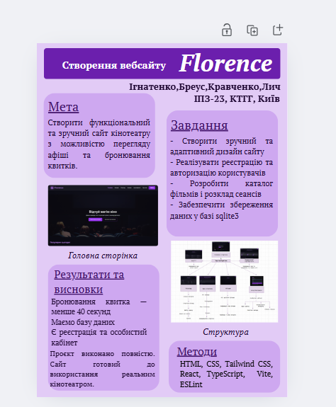

# Кіно Сайт Флоренція


## Вимоги

Для запуску потрібно встановити:

* **Node.js v22.20.0 або вище**
* **npm** (йде разом із Node.js)

---

## Команди запуску

### Встановлення залежностей
Перед запуском проєкту потрібно встановити всі залежності:

```
npm install
```

### Запуск клієнта у режимі хостингу

```
npm run dev:client -- --host
```

### Запуск сервера (API + база даних)

```
npx tsx watch src/server.ts
```

---

## Залежності

### Основні залежності

| Пакет                | Опис                                   |
| -------------------- | -------------------------------------- |
| **bcrypt**           | Хешування паролів.                     |
| **cors**             | Крос-доменний доступ до API.           |
| **express**          | Серверний фреймворк для створення API. |
| **framer-motion**    | Анімації в інтерфейсі.                 |
| **react**            | Основна бібліотека UI.                 |
| **react-dom**        | Рендеринг React у браузері.            |
| **react-router-dom** | Маршрутизація між сторінками.          |
| **sqlite3**          | Робота з локальною БД SQLite.          |

### Dev-залежності

| Пакет                              | Опис                                    |
| ---------------------------------- | --------------------------------------- |
| **vite**, **@vitejs/plugin-react** | Dev-сервер і збірка фронтенду.          |
| **tsx**                            | Запуск TypeScript без збірки.           |
| **typescript**                     | Підтримка TypeScript.                   |
| **eslint**, **@eslint/js**         | Перевірка якості коду.                  |
| **eslint-plugin-react-hooks**      | Правильність використання React Hooks.  |
| **eslint-plugin-react-refresh**    | Підтримка Fast Refresh.                 |
| **typescript-eslint**              | Лінтинг TS-коду.                        |
| **concurrently**                   | Паралельний запуск скриптів.            |
| **globals**                        | Глобальні змінні для ESLint.            |
| **@types/***                       | TypeScript-типи.                        |

---

## Структура проєкту

```
Florence
├── node_modules/              # Зовнішні залежності
├── src/
│   ├── assets/                # Статичні файли (зображення)
│   ├── components/            # UI-компоненти
│   │   ├── AuthModal.tsx          # Модальне вікно авторизації
│   │   ├── CertificateModal.tsx   # Модальне вікно сертифікатів
│   │   └── TicketModal.tsx        # Модальне вікно квитків
│   ├── data/
│   │   └── films.json         # Список фільмів
│   ├── pages/                 # Сторінки сайта
│   │   ├── About.tsx
│   │   ├── Certificates.tsx
│   │   ├── Discounts.tsx
│   │   ├── Films.tsx
│   │   ├── Home.tsx
│   │   ├── Profile.tsx
│   │   └── Schedule.tsx
│   ├── utils/                 # Утиліти та допоміжні функції
│   ├── App.tsx                # Головний компонент
│   ├── main.tsx               # Точка входу фронтенду
│   ├── server.ts              # Сервер (Express + SQLite)
│   └── styles.css             # Стилі застосунку
├── database.sqlite            # База даних
├── eslint.config.js           # Конфігурація ESLint
├── index.html                 # Основний HTML файл
├── package.json               # Опис проєкту та скриптів
├── package-lock.json          # Зафіксовані версії залежностей
├── tsconfig.json              # Загальна конфігурація TypeScript
├── tsconfig.app.json          # TypeScript для клієнтської частини
├── tsconfig.node.json         # TypeScript для Node.js
└── vite.config.ts             # Налаштування Vite
```

---

## База даних

У проєкті використовується **SQLite**, файл знаходиться тут:

```
database.sqlite
```

Сервер автоматично працює з нею через `sqlite3`.

## Постер



## Звiт
[Звiт](<Звіт команди (Лич_Ігнатенко_Кравченко_БреусІПЗ-23).docx>)
